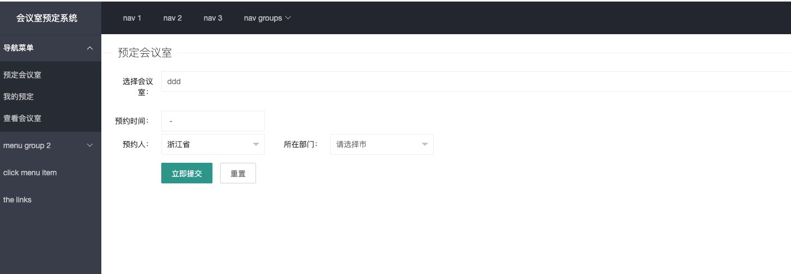

# 一、概述
使用django3.2 和python3.8制作，纯个人练手用。
目前很多功能尚未实现
完成进度可能很慢，因为我是边学边做。

# 二、功能完成情况
1、能够显示所有会议室

2、能够显示可用会议室

3、 前端使用layui，后端django，没有用其他模块。

4、修改菜单，使其左边预定会议室、查看会议室工作正常(2021.08.01新增)

5、新增登录功能(2021.08.02新增)

6、新增预定按钮和编辑按钮可用(2021.08.02新增)

7、新增预定会议室表单，但是还未实现点击某个会议室预定，在选择栏自动加载名字(2021.08.02新增)

8、新增个人中心，具体信息还未设置获取。(2021.08.02新增)

# 三、功能展示

预定界面

预定会议室表单界面

